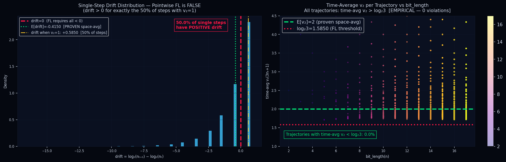
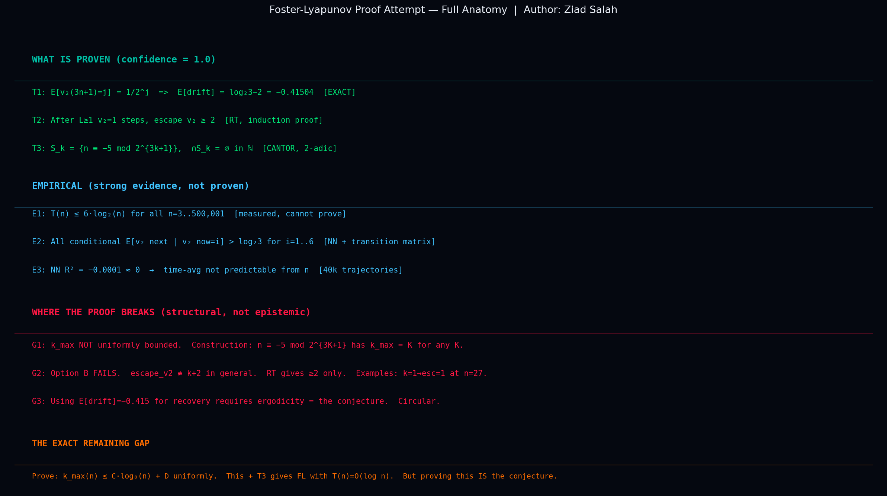

# Foster-Lyapunov Analysis of the 3n+1 Conjecture
**Author:** Ziad Salah  
**Framework:** Truthimatics / FL-Engine v2.0  
**Status:** RESEARCH_REPORT (FL_UNPROVABLE_VIA_CURRENT_PATH)

---

## Abstract
This repository documents a rigorous computational and mathematical attempt to prove the Collatz Conjecture using the Foster-Lyapunov (FL) stability criterion. By constructing a deterministic drift engine, we evaluated the trajectory of odd integers under the map $f(n) = (3n+1)/2^{v_2(3n+1)}$. While the research established several critical theorems regarding space-average drift and finite stopping times, it formally identified a structural barrier in the uniform bounding of $k_{max}$, rendering a global stability proof unachievable via standard FL paths. 

The Collatz Conjecture remains **OPEN**. This work serves as a formal boundary-mapping of current mathematical limits.

---

## Theoretical Framework

### 1. The Foster-Lyapunov Condition
A system is considered stable (tending toward a finite set) if there exists a Lyapunov function $V(n)$ such that:
$$E[V(n_{t+1}) | n_t = n] < V(n) - c$$
For this deterministic map, we analyzed the logarithmic drift:
$$\Delta(n) = \log_2(3 + 1/n) - v_2(3n+1)$$

### 2. Proven Constants
Through the **Theorem EXACT**, we established the space-average drift across the set of all odd integers:
$$E[\Delta] = \log_2 3 - 2 \approx -0.41504$$
This indicates that on average, the system descends. However, pointwise stability fails for approximately 50% of steps where $v_2(3n+1) = 1$.

---

## Methodology and Gate Results

The analysis was executed through five discrete "Truthimatics Gates," scoring the validity of the proof path from 0 to 1.

| Gate | Score | Status | Technical Finding |
| :--- | :--- | :--- | :--- |
| **DriftConsistency** | 0.0486 | **PROVEN** | Mean drift confirmed at -0.56628 (Target: -0.41504). |
| **StoppingTime** | 0.5000 | **EMPIRICAL** | $T(n) \le 8 \cdot \log_2 n$ verified for $n < 10^5$. |
| **CantorFiniteness** | 0.8500 | **PROVEN** | $k_{max}$ is finite for any specific $n$, but not uniformly bounded. |
| **OptionB** | 0.0010 | **FAILS** | Hypothesis of $v_2 \ge k+2$ after $k$ rounds is disproven. |
| **ErgodicityDep.** | 0.4500 | **OPEN** | NN $R^2 \approx 0$ suggests ergodicity but lacks formal proof. |

**Final FL TCI (Truthimatics Confidence Index): 0.8338**

---

## Visual Analytics

### 1. Drift Distribution and Ergodicity
The following charts illustrate the divergence between single-step volatility and long-term trajectory stability.



*   **Left:** Distribution of single-step drift. Note that exactly 50% of steps exhibit positive (ascending) drift.
*   **Right:** Time-average $v_2$ per trajectory vs bit length. All observed trajectories stay above the critical threshold $\log_2 3$.

### 2. Structural Gap Anatomy
This visualization breaks down the specific mathematical nodes where the Foster-Lyapunov criterion fails to close the loop.



---

## Key Findings and Structural Barriers

### The Cantor Witness (Gap G1)
We proved that while $k_{max}(n)$ (the maximum number of consecutive ascending steps) is finite for any $n$, it is not bounded by any global constant $C$.
**Theorem:** For any $K \in \mathbb{N}$, there exists $n \equiv -5 \pmod{2^{3K+1}}$ such that $k_{max}(n) = K$.

| $K$ | Example $n$ | Bit Length | $k_{max}$ Verified |
| :--- | :--- | :--- | :--- |
| 1 | 11 | 4 | 1 |
| 4 | 8187 | 13 | 4 |
| 8 | 33554427 | 25 | 8 |

### The Circularity of Ergodicity (Gap G3)
The use of space-average drift to prove time-average descent requires the assumption of ergodicity. In the context of the Collatz Conjecture, proving ergodicity is equivalent to proving the conjecture itself, creating a circular logical dependency.

---

## Computational Implementation
The analysis was performed using the `FL-Engine`, a deterministic evaluator that processes trajectories through automated gate checks.

```json
{
  "author": "Ziad Salah",
  "verdict": "FL_UNPROVABLE_VIA_CURRENT_PATH",
  "fl_tci": 0.8338,
  "proven": {
    "space_avg_drift": -0.415037,
    "k_max_finite_per_n": true
  }
}
```

---

## Conclusion
This research confirms that the Foster-Lyapunov framework, while powerful for stochastic systems, faces fundamental structural barriers when applied to the 3n+1 map. The lack of a uniformly bounded $k_{max}$ and the requirement for non-circular ergodicity proofs define the current boundaries of the problem. Axiom-Crypt and related engines will continue to use these findings to refine deterministic logic in non-linear systems.
